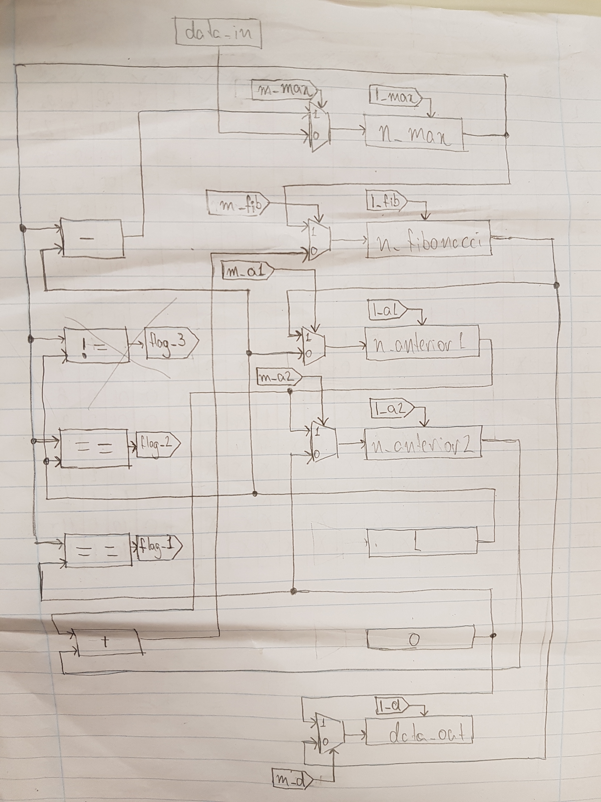

# Laboratório 1

## Datapath

## Tabela de trasição de estados

| Estados |  | Saídas |  |  |  |  |  |  |  |  |  |  |  | Entradas |  |  |  |  | Proximo Estado |
|----------|------------|--------|-------|-------|-------|------|------|------|------|-----|-----|----------|-------|----------------|---------------|--------|--------|--------|----------------|
| state_id | state_bool | m_max | l_max | m_fib | l_fib | m_a1 | l_a1 | m_a2 | l_a2 | m_d | l_d | status_o | irq_o | write_enable_i | read_enable_i | flag_1 | flag_2 | flag_3 |  |
| 0 | 0 | x | x | x | x | x | x | x | x | 1 | 1 | 00 | 0 | 0 | x | x | x | x | 0 |
| 0 | 0 | x | x | x | x | x | x | x | x | 1 | 1 | 00 | 0 | 1 | x | x | x | x | 1 |
| 1 | 1 | x | x | x | x | 0 | 1 | x | x | x | 0 | 00 | 0 | x | x | x | x | x | 2 |
| 2 | 10 | x | x | x | x | x | 0 | 0 | 1 | x | 0 | 00 | 0 | x | x | x | x | x | 3 |
| 3 | 11 | 0 | 1 | x | x | x | 0 | x | 0 | x | 0 | 01 | 0 | x | x | x | x | x | 4 |
| 4 | 100 | x | 0 | x | x | x | 0 | x | 0 | x | 0 | 01 | 0 | x | x | 1 | x | x | 5 |
| 4 | 100 | x | 0 | x | x | x | 0 | x | 0 | x | 0 | 01 | 0 | x | x | 0 | x | x | 6 |
| 5 | 101 | x | 0 | 1 | 1 | x | 0 | x | 0 | x | 0 | 01 | 0 | x | x | x | x | x | 13 |
| 6 | 110 | x | 0 | x | x | x | 0 | x | 0 | x | 0 | 01 | 0 | x | x | x | 1 | x | 7 |
| 6 | 110 | x | 0 | x | x | x | 0 | x | 0 | x | 0 | 01 | 0 | x | x | x | 0 | x | 8 |
| 7 | 111 | x | 0 | 1 | 1 | x | 0 | x | 0 | x | 0 | 01 | 0 | x | x | x | x | x | 13 |
| 8 | 1000 | x | 0 | x | x | x | 0 | x | 0 | x | 0 | 01 | 0 | x | x | x | x | 1 | 9 |
| 8 | 1000 | x | 0 | x | x | x | 0 | x | 0 | x | 0 | 01 | 0 | x | x | x | x | 0 | 13 |
| 9 | 1001 | x | 0 | 0 | 1 | x | 0 | x | 0 | x | 0 | 01 | 0 | x | x | x | x | x | 10 |
| 10 | 1010 | x | 0 | x | 0 | x | 0 | 1 | 1 | x | 0 | 01 | 0 | x | x | x | x | x | 11 |
| 11 | 1011 | x | 0 | x | 0 | 1 | 1 | x | 0 | x | 0 | 01 | 0 | x | x | x | x | x | 12 |
| 12 | 1100 | 1 | 1 | x | 0 | x | 0 | x | 0 | x | 0 | 01 | 0 | x | x | x | x | x | 8 |
| 13 | 1101 | x | 0 | x | 0 | x | 0 | x | 0 | 0 | 1 | 10 | 1 | x | 0 | x | x | x | 13 |
| 13 | 1101 | x | 0 | x | 0 | x | 0 | x | 0 | 0 | 1 | 10 | 1 | x | 1 | x | x | x | 0 |